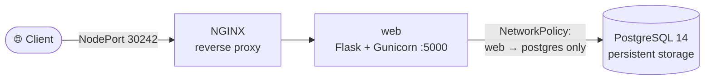

<div align="center">


# Deploy a Flask + PostgreSQL CRUD App on Kubernetes with an NGINX Reverse Proxy

**A three-tier web app — NGINX → Flask → PostgreSQL — packaged as containers and deployed to Minikube with NetworkPolicies, or to Docker Swarm as a stack.**

<p>
  
  
  
  
  
  
</p>

</div>

---

The middle step of my container-orchestration learning path — it takes the [Flask/PostgreSQL CRUD dashboard](https://github.com/intikhab49/flask-postgres-crud-dashboard) and runs it **behind NGINX on Kubernetes**. For the extended version with a logging microservice and Prometheus monitoring, see **[kubernetes-flask-microservices](https://github.com/intikhab49/kubernetes-flask-microservices)**.

## 🏗️ Architecture



**What it demonstrates**

- 🐳 Custom Docker images for the Flask app and NGINX
- ☸️ Kubernetes Deployments + Services, exposed through a `NodePort`
- 🔒 `NetworkPolicy` rules: only NGINX can reach web, only web can reach Postgres
- ⏳ Startup script that waits for PostgreSQL readiness before initializing the schema and starting Gunicorn
- 🐝 The same stack deployed to Docker Swarm with an automated redeploy script
- 🔄 CRUD REST API + Bootstrap web UI with a health check

## ☸️ Deploy on Kubernetes (Minikube)

```bash
git clone https://github.com/intikhab49/kubernetes-flask-crud.git
cd kubernetes-flask-crud

minikube start
docker build -t myapp-web:latest .
docker build -t nginx-custom:latest ./nginx
minikube image load myapp-web:latest
minikube image load nginx-custom:latest

kubectl apply -f postgres-deployment.yaml
kubectl apply -f web-deployment.yaml
kubectl apply -f nginx-deployment.yaml
kubectl apply -f web-to-postgres-policy.yaml -f network-policy.yaml

minikube service nginx --url
```

## 🐝 Deploy on Docker Swarm

```bash
docker swarm init
./deploy.sh          # redeploys docker-compose.yml as the "my-app" stack
curl http://localhost:9000/users
```

The compose file pulls the web and NGINX images from a local registry at `localhost:5000` and publishes NGINX on port **9000**.

## 📡 REST API

| Method | Endpoint | Description |
|---|---|---|
| GET | `/` | Web UI |
| GET | `/users` | List users |
| POST | `/users` | Create a user `{"name", "email"}` |
| PUT | `/users/{id}` | Update a user |
| DELETE | `/users/{id}` | Delete a user |
| GET | `/health` | Health check |

## 🗂️ Project structure

```
app.py · models.py · templates/ · static/          # Flask app + UI
Dockerfile · start.sh                              # web image + DB-wait startup
nginx/                                             # NGINX image and config
postgres-deployment.yaml · web-deployment.yaml · nginx-deployment.yaml
web-to-postgres-policy.yaml · network-policy.yaml  # NetworkPolicies
docker-compose.yml · deploy.sh                     # Docker Swarm stack
```

---

<div align="center">

**Built by [Intikhab Azam](https://github.com/intikhab49)** — AI & automation engineer · backend · DevOps

<sub>Keywords: Kubernetes Flask tutorial · deploy Flask on Kubernetes · Minikube · NGINX reverse proxy · PostgreSQL · Kubernetes NetworkPolicy · Docker Swarm stack · Gunicorn · DevOps project</sub>

</div>
